# Bristol's beeches and the 2026 drought

How did Bristol's council-managed beeches, especially the big old ones, cope
with the 2026 drought, and were they hit harder than other large trees?
Satellite imagery, a LIDAR laser survey and the council's tree register,
combined in PostGIS and QGIS.

**[Interactive map](https://kasparszpoj-bit.github.io/bristol-beech-drought/)**.
Bristol's 1,927 large council trees, coloured by how far their chlorophyll
fell against their usual summers. Play through 2018 to 2026, zoom in to see
each LIDAR crown, and click a tree for its history.

[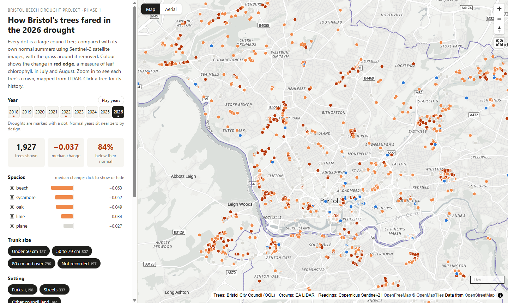](https://kasparszpoj-bit.github.io/bristol-beech-drought/)

**Author:** Kaspar Szpojnarowicz
**Status:** Phase 1, the desk analysis and report, complete (2 October
2026). Phase 2, checking the results on the ground and finding real giant
polypore cases, runs from October 2026 to summer 2027.

| | |
|---|---|
| Question | Did the 2026 drought hit beeches harder than oak, lime, plane and sycamore, and the oldest beeches hardest? |
| Trees | Bristol City Council's register: 56,581 trees; 8,623 large comparison trees mapped as crowns; 1,927 analysable, 195 of them beech |
| Data | Council tree register, Sentinel-2 imagery 2018 to 2026 (243 images), Environment Agency 1 m LIDAR, Met Office station records, a field survey |
| Methods | SQL cleaning and QA, crown mapping from LIDAR, three QGIS Processing models, satellite indices per crown, mixed pixel correction, bootstrap comparisons |
| Tools | PostgreSQL and PostGIS, QGIS (Graphical Modeler, run headless), Python, MapLibre, Power BI, QField |
| Outputs | This write-up, an [interactive web map](https://kasparszpoj-bit.github.io/bristol-beech-drought/), a [four-page Power BI report](#the-power-bi-report), three QGIS models |

## The project in two phases

| Phase | Question | Status |
|---|---|---|
| **1. Desk analysis and report** | What does the satellite show about how Bristol's trees, and beech in particular, coped with 2026? | Complete: findings, figures, web map, Power BI report |
| **2. Ground truth and giant polypore cases** | Is the satellite right on the ground, and does it pick out trees with giant polypore? | Started: a pilot field walk on 30 September 2026 and the first confirmed case on 2 October |

**Contents:** [The tree that started it](#the-tree-that-started-it) ·
[Key findings](#key-findings) · [Data](#data) · [Method](#method) ·
[Results](#results) · [Web map](#the-interactive-web-map) ·
[Power BI report](#the-power-bi-report) · [Limitations](#limitations) ·
[Decisions and trade-offs](#decisions-and-trade-offs) ·
[Phase 2](#phase-2-ground-truth-and-giant-polypore-cases) ·
[Reproduce it](#reproduce-it)

## The tree that started it

At my family's house in north Bristol there is a large copper beech, probably
planted in the Victorian era and well over a metre across at the trunk. In
2017 one of its main stems died and was cut out. Since then, giant polypore
(*Meripilus giganteus*), a root rot that can make beeches fall at the roots
with little warning in the crown, has fruited around its base, and in autumn
2026, after an exceptionally dry summer, it came up all around the tree. The
tree stands over a road and within falling distance of the house, and an
arborist is assessing it.

A family friend had a large copper beech uprooted in a storm. She was the
one who first told me about giant polypore, and that is where I started
looking into it.

It is also where I am putting my recent training to work: Kaggle's Python
and SQL courses and Esri's ArcGIS Imagery MOOC gave me the foundations, and
this project applies them to real, messy data and takes them further.

That raised the question this project asks at city scale: how are Bristol's
big old beeches coping, and did the 2026 drought hit them harder than other
trees? The garden tree runs through the project as a case study, and its
log at the end of the results will be updated as its story develops. Its
location is deliberately withheld.

# Phase 1: desk analysis and report

## Key findings

Each finding compares a tree's July and August satellite readings with the
same tree's own normal years (2019 to 2021, 2023, 2024), after removing the
ground's share of every reading.

1. **2026 was hotter than 2018, but most trees coped no worse.** Across all
   five species, the 2026 fall in red edge (a measure of chlorophyll) was
   the same size as in 2018 (difference +0.001, 95% interval −0.001 to
   +0.004), and greenness and leaf moisture fell less than in 2018. The
   2026 stress was widespread but shallow: 84% of crowns read below normal
   on red edge, the highest share of any year, yet greenness barely fell,
   and on the ground in late September crowns looked healthy. (Figure 6)
2. **Beech was the exception: the only species clearly worse in 2026 than
   in 2018.** Comparing the same 195 beeches in both droughts, their red
   edge fell 0.012 further in 2026 (95% interval 0.004 to 0.028), while oak
   fared clearly better (0.012 less) and lime, plane and sycamore were
   unchanged. In 2018 oak was hit hardest; in 2026 beech was, at −0.063
   (95% interval −0.069 to −0.056), ahead of sycamore −0.052, oak −0.049,
   lime −0.034 and plane −0.027. Beech's shallow roots and two dry growing
   seasons in a row (2025 and 2026) are a likely explanation, not a tested
   one. (Figure 8)
3. **The oldest beeches were not clearly worse.** Beeches with trunks of
   80 cm and over read −0.064, those of 50 to 79 cm −0.050, with
   overlapping intervals; in 2018 the largest were the least affected.
   (Figure 9)
4. **Most of the raw satellite signal was grass.** At 10 m, a crown's pixels
   include the ground around it, and in a dry summer grass loses five to
   twenty times more greenness than trees. Measuring each crown's canopy
   share from LIDAR and removing the ground was essential: without it, the
   results would have mostly measured lawns. (Figure 7)
5. **The garden tree lost more greenness and red edge in 2026 than most
   large council beeches**, consistent with a tree whose roots are decaying,
   but not proof of it. (Figure 10)

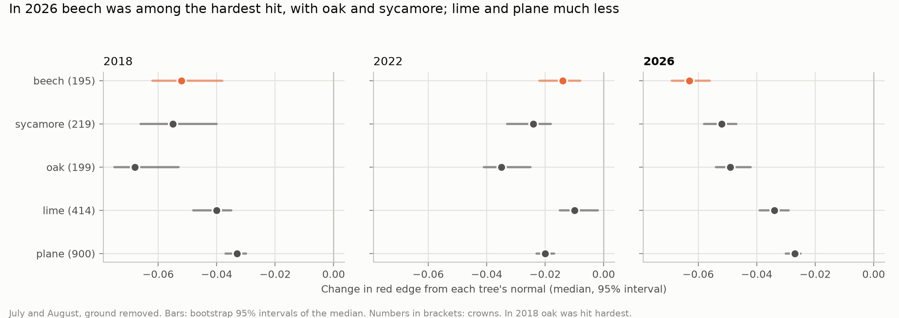

*Figure 8 (headline). Change in red edge from each tree's normal, by
species, in the three drought years. Dots: medians; bars: bootstrap 95%
intervals; numbers: crowns.*

## Why it matters

Beech is one of Britain's most drought-sensitive large trees, with shallow
roots and a history of dieback after hot, dry summers. Many of Bristol's
biggest beeches are Victorian park and street trees, and they stand beside
paths, roads and houses. Stress that does not yet show in the crown can show
the following year, and a stressed beech with root decay is a safety
question as well as an ecological one. Knowing which species and which
trees were hit hardest helps a council decide where to look first.

## Data

| Source | What it gives | Dates | Licence |
|---|---|---|---|
| Bristol City Council tree register (ArcGIS REST) | Every council tree: species, trunk size, crown size, site | Downloaded 28 to 30 Sept 2026 | OGL 3.0 |
| Sentinel-2 L2A, Earth Search on AWS | 10 to 20 m imagery: red, near infrared, red edge, shortwave infrared, scene classification | 243 images, May to Oct, 2018 to 2026 | Copernicus open |
| Environment Agency LIDAR Composite | 1 m terrain and surface models: canopy height and crowns | Composite of surveys | OGL 3.0 |
| OS OpenMap Local | Building footprints and roads | 2026 | OGL 3.0 |
| Met Office historic station data | Monthly rain and temperature, Yeovilton and Cardiff Bute Park | 1964 to 2026 | Open |
| ONS local authority boundaries | Bristol boundary | May 2026 | OGL 3.0 |
| Field survey (QField) | Crown condition of 41 randomly drawn trees, a pilot for Phase 2 | 30 Sept 2026 | This project |

Data quality detail, including everything found wrong with the register, is
in [docs/data_quality_register.md](docs/data_quality_register.md).

## Method

Six steps. Full detail in [docs/methods.md](docs/methods.md); every step, in
order and with its reasons, in [docs/project_log.md](docs/project_log.md).

1. **Trees into PostGIS.** The council's register loaded through its API,
   stored untouched, and cleaned in published SQL. Comparison groups: beech,
   oak, lime, plane, sycamore.
2. **Crowns from LIDAR (QGIS model 01).** A crown for every large comparison
   tree from 1 m canopy height, with roofs removed and touching crowns split
   between neighbours: 8,623 crowns.
3. **Satellite readings per crown (QGIS model 02).** Each image is cloud
   masked pixel by pixel; greenness (NDVI), leaf moisture (NDMI) and red edge
   (NDRE) are averaged over every crown. Run once per image, 243 times.
4. **Removing the ground (QGIS model 03 and SQL).** A canopy cover map from
   the LIDAR gives each crown's canopy share; model 03 reads the ground in a
   ring around each crown on the same image; the ground's share is
   subtracted.
5. **Each tree against its own normal.** The July and August median each
   year, against the median of the normal years; 2018 and 2022 are known
   drought years that test the method.
6. **Comparisons.** Species and size compared with bootstrap intervals,
   also among crowns of similar canopy share. A pilot field check with
   QField tested the method; Phase 2 takes it further.

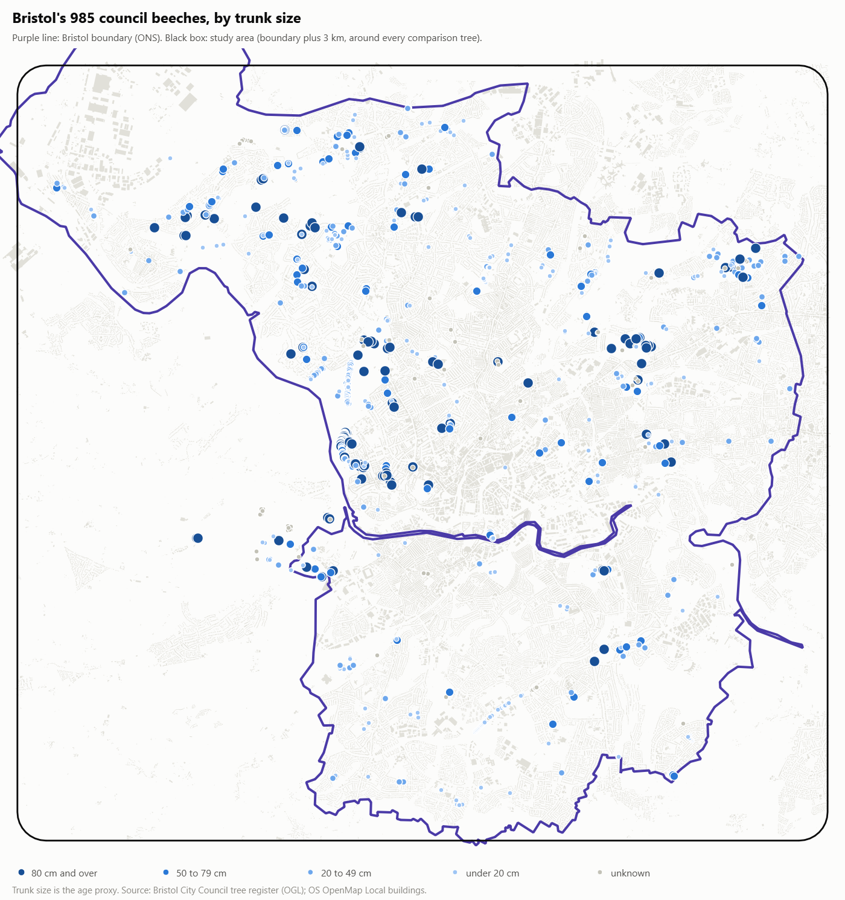

*Figure 1. Bristol's 985 council beeches by trunk size (the age proxy),
with the Bristol boundary and the study area.*

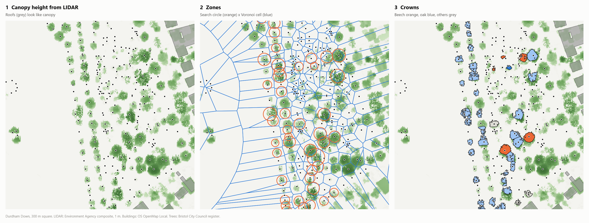

*Figure 2. How a crown is drawn, on Durdham Down: canopy height from LIDAR,
where roofs look like canopy (1); each tree's zone, its search circle
intersected with its own Voronoi cell (2); the finished crowns (3).*

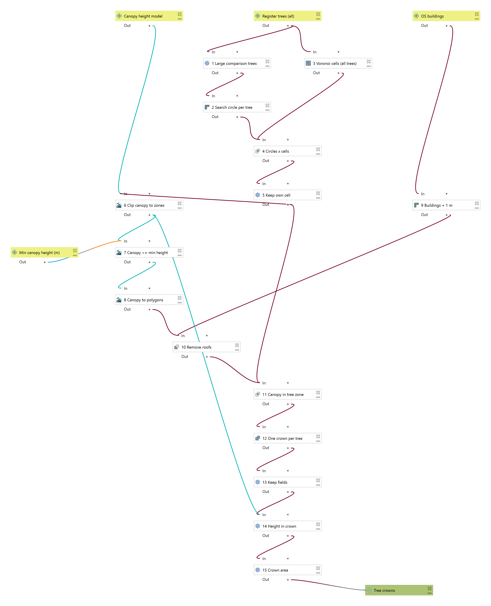

*Figure 3. QGIS model 01, as drawn by the Graphical Modeler: 15 steps from
LIDAR, register trees and buildings to crowns.*

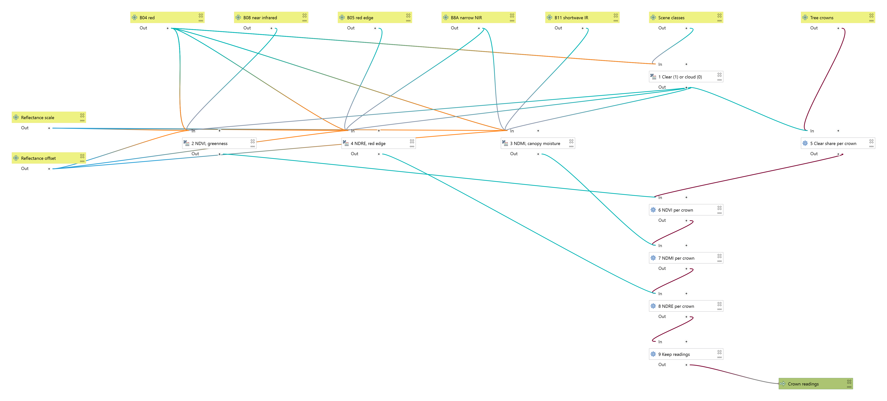

*Figure 4. QGIS model 02: for each image, mask cloud, compute three indices
on the 10 m grid, and average each over every crown. Model 03 is the same
chain run over a ring around each crown, keeping only ground pixels.*

## Results

### How extreme was 2026?

Bristol has no long Met Office record, so the two stations either side of it
were used: Yeovilton, about 50 km south, and Cardiff Bute Park, about 40 km
west. By summer rainfall alone, 2026 was not a record: 1976, 1995 and 2018
were drier. What made it extreme was **heat on top of dryness, after a dry
year**: the hottest summer on record at both stations (mean June to August
maximum 25.3 °C at Yeovilton over 62 years, 24.7 °C at Cardiff over 49), the
driest July on record at both (2.2 mm and 4.2 mm), and a dry growing season
straight after 2025, the driest growing season on record at Yeovilton.

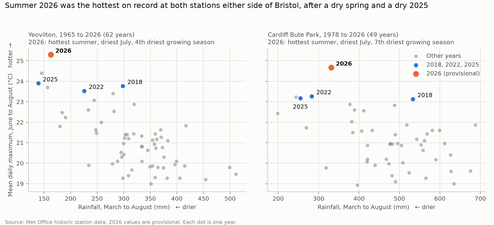

*Figure 5. Each dot is one year. 2026 sits alone in the hot, dry corner, with
2025 close by. 2026 values are provisional.*

### Does the method see drought?

Before trusting anything about 2026, the method had to find the droughts we
already know about. It does: 2018 and 2022 both read below normal, 2018 most
strongly. 2026 is close to 2018 in depth (median −0.037 against −0.041, a
difference within the uncertainty) and put the most crowns below their
normal of any year (84%): more trees affected, but not more deeply.

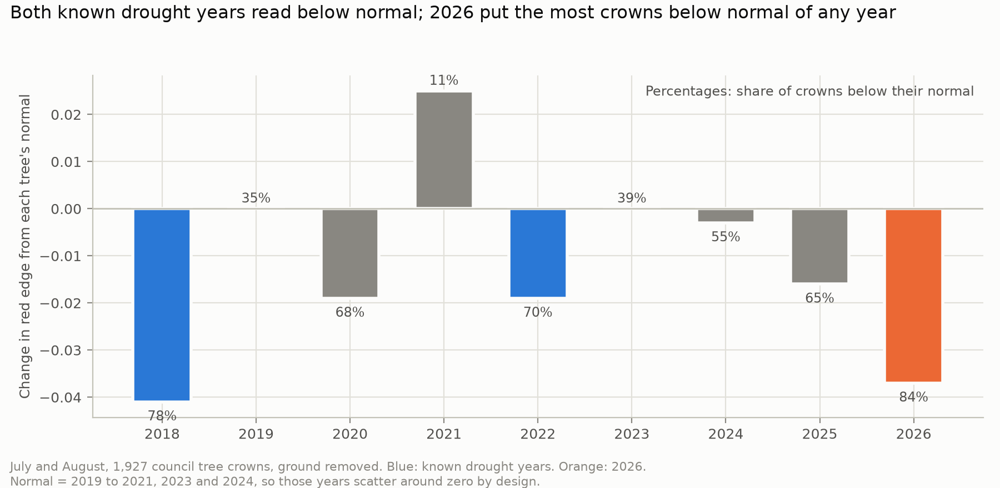

*Figure 6. Median change in red edge from each tree's normal, across 1,927
crowns. The normal years scatter around zero by design.*

### Most of the raw signal was grass

At 10 m, a 13 m crown covers about 1.4 pixels, so every crown reading
includes the ground around it. Twenty open grass plots on the Downs showed
how much that matters: in dry summers grass lost 0.37 to 0.46 of its
greenness, against under 0.1 for trees. On the Downs, the raw readings made
limes, the trees with the smallest crowns, look hardest hit. Once the ground
was removed (canopy share from LIDAR, local ground from a ring around each
crown), the city-wide picture changed: canopy greenness barely fell in 2026,
the drop showed in red edge and moisture instead, and beech stood apart from
the other species. The check that the correction worked: afterwards, the red
edge change no longer varies with how much of a crown's reading is canopy.

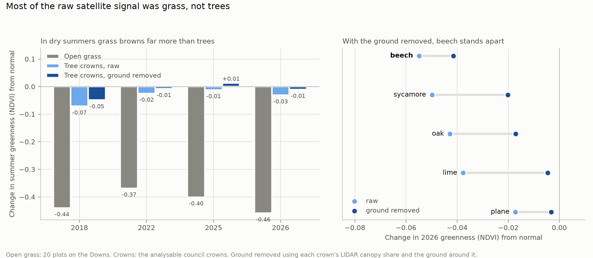

*Figure 7. Left: change in summer greenness for open grass and for tree
crowns before and after removing the ground. Right: each species in 2026,
before (light) and after (dark).*

### Which species were hit hardest?

Beech, sycamore and oak form the hardest-hit group in 2026; lime and plane
were much less affected (Figure 8, above). Beech minus all other species:
red edge −0.028 (95% interval −0.035 to −0.020), moisture −0.035, greenness
−0.034. Compared only among crowns of similar canopy share (0.70 to 0.85),
beech (−0.056) overlaps with oak and sycamore, so "among the hardest hit" is
the fair claim, not "the hardest hit". The change since 2018 is
interesting: then oak was hit hardest and beech less; in 2026 beech moved to
the top, after two dry years running.

### Were the oldest beeches worst?

No clear sign. Trunk size is the only age measure in the register, and it is
partly estimated, so it is used in broad classes.

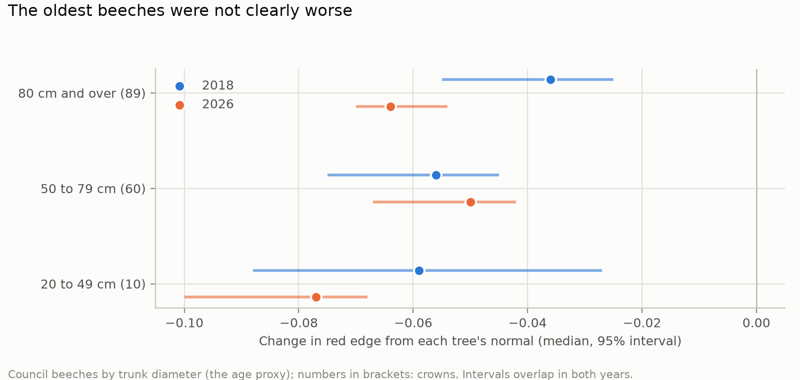

*Figure 9. Change in red edge for council beeches by trunk size, 2018 and
2026, with 95% intervals.*

### A pilot field check

On 30 September 2026, 41 randomly drawn trees on Clifton and Durdham Downs
were scored with QField, as a pilot for Phase 2. On the ground the trees
were broadly healthy: 8 of the 39 trees compared showed any visible stress.
The walk earned its place in Phase 1 twice over:

- **It caught the raw satellite readings being wrong.** They showed almost
  every Downs tree as badly stressed, against healthy crowns on the ground.
  That mismatch led to the grass check and the correction above.
- **It agrees in direction with the corrected readings.** The 4 stressed
  trees with usable readings read lower (red edge −0.074 against −0.062),
  and the rank correlation with crown thinning is −0.32. Too few trees to
  confirm it, which is what Phase 2 is for.

The full pilot results are under
[Phase 2](#what-the-pilot-walk-found-so-far).

### The garden tree: case study log

The garden tree was run through exactly the same models, kept in a private
database schema. About half of each of its readings is the garden and road
around it, so its line is noisier than most.

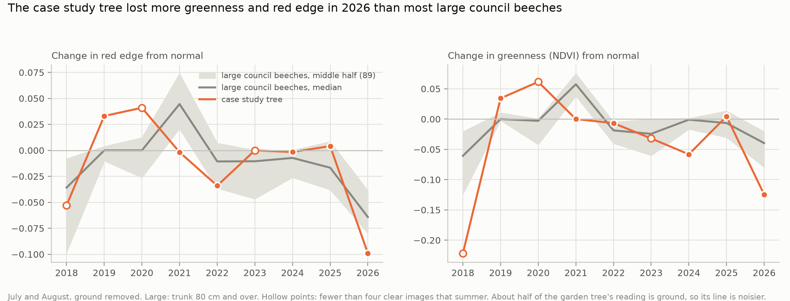

*Figure 10. The garden tree's change from its own normal, against the 89
large council beeches (trunk 80 cm and over). Hollow points: fewer than four
clear images that summer.*

| When | What happened |
|---|---|
| 2017 | A main stem died back and was removed; the crown was reduced to rebalance the tree |
| 2024 to 2026 | Giant polypore fruiting at the base in successive autumns |
| Summer 2026 | Severe drought across southern England; a very heavy nut crop followed |
| Late 2025 to 2026 | The 2017 cut, once clean and flat, has cracked and is visibly decaying around the stub |
| Summer 2026, satellite | With the ground removed, its greenness fell −0.125 against a median of −0.040 for large council beeches (only 9 of 89 fell further), and its red edge −0.099 against −0.064 (14 of 89 fell further). Consistent with root decay; not proof of it |
| September 2026 | Fruiting bodies all around the base, from the trunk out to about 2 m, recorded and photographed |
| September 2026 | A consultant arboriculturist (a Registered Consultant of the Arboricultural Association) reviewed photos and video. Advice: the number of fruiting bodies is not a direct measure of how much root is decayed, so the tree may not yet be structurally compromised, but the decay will progress. Options offered: a dynamic stability assessment (sensors measuring how the tree moves in wind), or removal and replanting. **Decision pending.** |

## The interactive web map

**[Open the map](https://kasparszpoj-bit.github.io/bristol-beech-drought/)**.
Built for this project with MapLibre GL JS and hosted on GitHub Pages from
[web/](web/), so anyone can use it without an account or an install.

- Every analysable council tree (1,927), coloured by its change in red edge
  from its own normal, in the same bands as the Power BI report.
- Year buttons and a play control to step through 2018 to 2026, with the
  drought years marked.
- Filters for species, trunk size and setting. The headline numbers and a
  species chart update as you filter; click a species to show or hide it.
- Crowns as mapped from LIDAR once you zoom in, on a street map or aerial
  imagery, and a search for any park or street.
- Click a tree for its details and its year by year history.

`beech-web-export` writes the three GeoJSON files (trees, crowns, Bristol
boundary) straight from PostGIS. Council trees only: nothing is read from
the private schema, so the garden tree cannot appear.

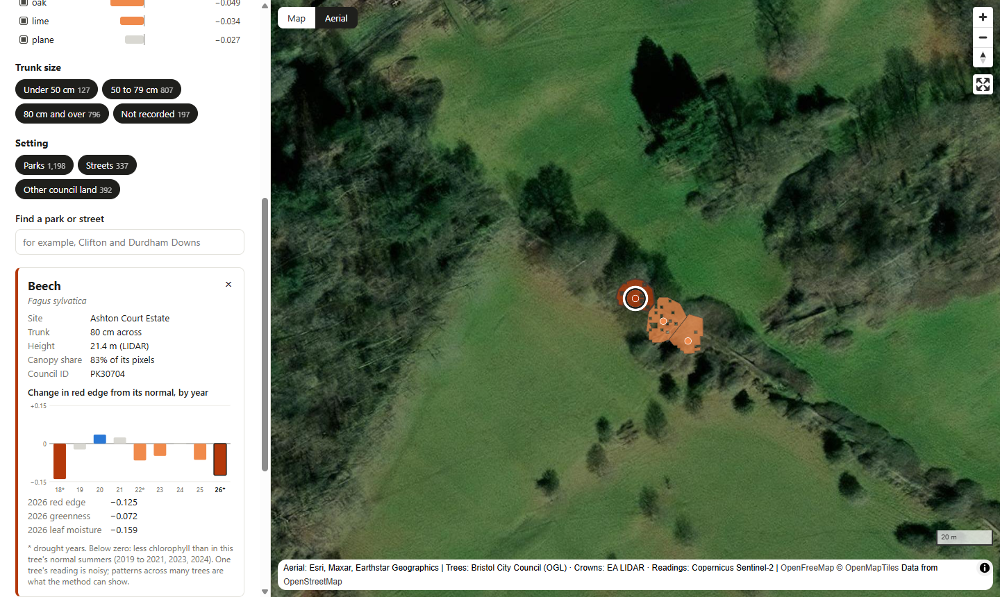

*Figure 11. The web map zoomed in on Ashton Court, on aerial imagery. Each
crown is drawn from LIDAR and coloured by its 2026 change; the selected
beech read below its normal in 2018 and fell further in 2026.*

## The Power BI report

Four pages, saved as a Power BI project (`.pbip`) in [powerbi/](powerbi/), so
the model and every visual are text files under version control. The page
layouts are generated by Python (`beech-powerbi-report`), and every number
was checked against the Python analysis with DAX queries. How to open it,
and how it is built: [powerbi/README.md](powerbi/README.md).

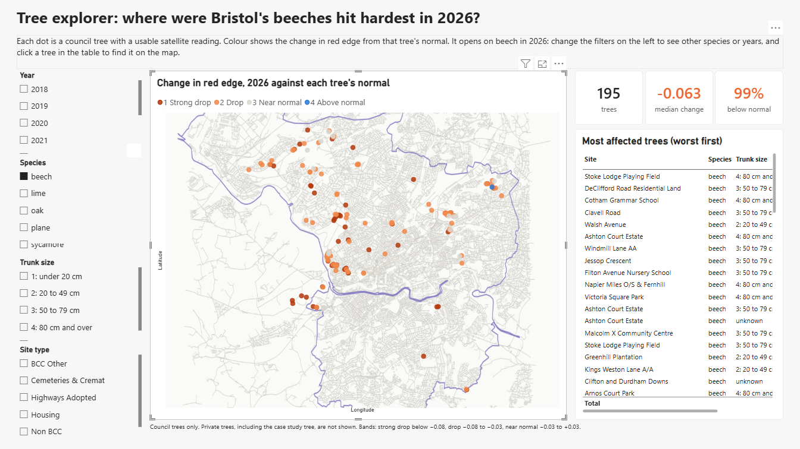

*Page 1, tree explorer. Opens on beech in 2026; slicers for year, species,
trunk size and site type, and the most affected trees. Power BI's own map
visuals need a work or school sign-in, so the trees are drawn over a
basemap rendered in QGIS for exactly the chart's axis range.*

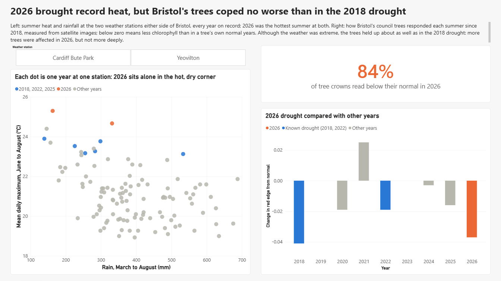

*Page 2, drought. 2026 against every summer on record at two stations, and
the trees' response each year since 2018.*

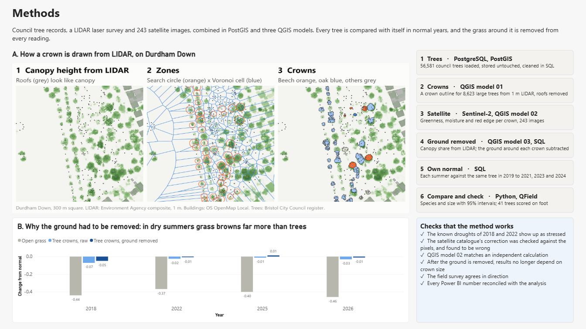

*Page 3, methods. How a crown is drawn, the six steps, why the ground had to
be removed, and the checks that the method works.*

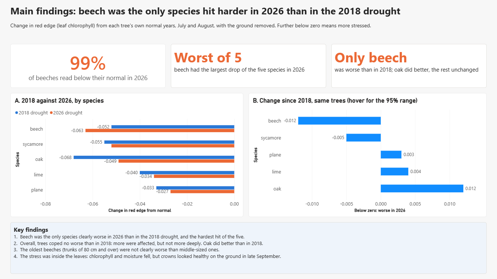

*Page 4, main findings. Beech against the other four species in 2018 and
2026, and the change between them for the same trees.*

## Limitations

- **Pixel size.** At 10 m most crowns are a few mixed pixels. The ground
  correction removes most of the ground's influence but not all: it is
  linear in reflectance, applied here to ratio indices, and only crowns at
  least half canopy are used (1,927 of 8,623).
- **Satellite against eye.** Red edge and moisture changes are not visible
  from the ground, and the field survey was in late September against
  July and August readings, so close tree-by-tree agreement was never
  likely.
- **Small pilot field sample.** 39 trees compared, 4 of them stressed,
  only 3 oaks: enough to catch a broken method, not to test species
  differences. Phase 2 extends it.
- **Age is a proxy.** Trunk diameters are partly estimated (they cluster on
  round numbers), so they are used only in broad classes.
- **Correlation, not cause.** Street trees may be watered, soils differ,
  and the LIDAR survey predates 2026. Nothing here shows why a tree was
  stressed.
- **Not an arboricultural assessment.** Nothing here says whether any
  individual tree is safe.
- **Provisional weather.** The 2026 Met Office values are provisional.

## Decisions and trade-offs

The choices that shaped the results, and why.

**Data**

- **Keep the raw data untouched; clean it in SQL.** The register is stored
  exactly as delivered, and every cleaning step is a published SQL query,
  so any number can be traced back and rerun.
- **Key trees on the council's asset ID, not the database ID.** Between two
  downloads two days apart, the council's service regenerated every
  OBJECTID. Every link across downloads uses the stable ASSET_ID, and the
  field sample, once issued, is frozen on it.
- **Trunk size only in broad classes.** 15 to 20% of trunk diameters fall
  on a multiple of 10 cm, against about 10% if measured.
- **Drought is more than low rainfall.** By summer rain alone 2026 was not
  a record; the record was heat after a dry year. Claiming a rainfall
  record would have been wrong.
- **A study area drawn from the official boundary.** Bristol plus 3 km keeps
  parks just over the line and drops two distant council sites that would
  have stretched the study area to 41 km by 42 km.

**Satellite**

- **The less tidy archive, on purpose.** The reprocessed Sentinel-2
  collection has no 2022 images over Bristol, and 2022 is one of the two
  droughts that test the method.
- **Check the pixels, not just the catalogue.** The catalogue gives an
  offset of −0.1 for almost every image. The stored values show it had
  already been removed; applying it would have darkened every image from
  June 2018 and corrupted the indices. The evidence is kept for every image.
- **Known droughts as a built-in test.** If 2018 and 2022 had not read as
  stressed, the method would be wrong, whatever it said about 2026.
- **Cloud masked pixel by pixel.** Clear July and August images are rare in
  normal years (0 to 2 a year), so waiting for clear days would leave the
  baseline almost empty.
- **Each tree against its own normal.** A copper beech always looks less
  green than a green beech, and a street tree than a park tree; comparing
  each tree with itself removes that.
- **Remove the ground before comparing trees.** The raw ranking on the
  Downs followed crown size. Each crown's canopy share was measured from
  LIDAR on the satellite's own grid, its local ground read from a ring
  around it, and the ground subtracted; crowns in dense groves borrow the
  ground of rings within 100 m. Afterwards, the red edge change no longer
  varies with canopy share.
- **Compare like with like.** Beech has the largest crowns, so species were
  also compared among crowns of similar canopy share; that turned "beech
  was hardest hit" into the fairer "beech was among the hardest hit".

**Crowns**

- **Roofs are not trees.** Building footprints are removed before crowns are
  drawn.
- **Split touching crowns between neighbours.** Voronoi cells from all
  56,581 register trees, limited by a circle sized from the register's
  crown width, so a register tree cannot claim a private garden's canopy.
- **Measure a problem before fixing it.** Most crowns came out in pieces;
  pieces more than 2 m from the tree's own were 0.4% of crown area, so the
  281 crowns where they exceed 10% were left out rather than rerunning an
  hour of processing.
- **Models as code.** All three QGIS models are written as Python, saved as
  Graphical Modeler files and run headless, so the same steps rerun on new
  data with one command.
- **Download only what is needed.** Only the 1 km LIDAR squares holding
  large trees (plus neighbours) were fetched, not the whole city.

**Reporting**

- **A web map as well as Power BI.** Power BI's map visuals need a work or
  school account, so its tree explorer draws trees over a QGIS-rendered
  basemap. The web map, open to anyone, is the fully interactive one.
- **The report as code.** Pages written as JSON by Python and the model in
  TMDL, so the report can be rebuilt, reviewed and versioned like the rest.
- **Check the joins, not just the visuals.** Power BI read the first IDs as
  numbers and silently dropped most readings from their trees; a distinct
  count against the database caught it. Every figure on the pages was then
  reconciled with the analysis.

**Field**

- **Field trees picked at random, not by eye.** Choosing trees that looked
  stressed would have guaranteed a match with the satellite and proved
  nothing.
- **Set trees aside, never delete them, and say why.** Dead, felled or
  misidentified trees stay in every table, listed with their reason in
  `analysis.field_exclusions`.
- **Ask the person who was there.** The satellite seemed to date tree 10's
  crown loss to late August 2026. The surveyor remembered grey, weathered
  cut ends, so that reading was wrong and never reached the report.
- **Healthy trees are a result too.** A method that reported widespread
  damage on trees that looked healthy would be wrong.

# Phase 2: ground truth and giant polypore cases

Phase 1 shows what the satellite sees. Phase 2 asks whether it is right on
the ground, and whether it can pick out trees with giant polypore. It runs
from October 2026 to summer 2027.

1. **Ground truth with QField.** Finish the random field sample (61 trees
   drawn, 41 scored so far), check the scoring by rescoring some trees
   blind, and test properly whether trees scored as stressed read lower on
   the satellite.
2. **Real giant polypore cases.** Do infected beeches show the same
   satellite signal as the garden tree? Three sources of fungus records:
   - **NBN Atlas** records of *Meripilus giganteus*.
   - **Bristol's FixMyStreet**, where the public reports trees by category
     ("Tree in poor health"), with dates, locations and photos. Matched to
     register trees by location, these show which stressed beeches the
     council already knows about, and which nobody has reported. Locations,
     dates and categories only; never reporters' names.
   - **Field sightings** outside the random sample, recorded separately so
     they cannot bias the field check (`raw.opportunistic_obs`).

   *The first case.* On 2 October 2026 a large beech at the Grenville Road
   edge of St Andrews Park (council tree PK31500) had lost most of its
   leaves and had giant polypore at its base. A member of the public had
   already reported the fungus on FixMyStreet on 15 September; the council
   investigated and passed it to its contractors on 25 September. On the
   satellite its 2026 greenness fell more than three quarters of the
   city's beeches, but less than the crown loss seen on the ground: the
   July and August window misses September leaf loss, and evergreen yews
   5 to 9 m away keep its mixed pixels green. So Phase 2 also adds
   September images for late-season damage. The register records it as a
   green beech with no trunk diameter; it was reported as a copper beech,
   still to be confirmed.
3. **Which beeches to inspect.** Large beeches showing 2026 stress, near
   giant polypore records, with a road or building within falling distance:
   a short ranked list for a tree officer.
4. **Response clusters.** Grouping trees by how they responded from 2018 to
   2026, and where the garden tree falls.
5. **A Power BI page on the ground truth:** the field check by species,
   whether trees scored as stressed read lower on the satellite, the garden
   tree against Bristol's large beeches, and the confirmed polypore cases.
6. **A 2027 re-score** of the field sample, to catch drought damage that
   shows a year late, which is common in beech.

## What the pilot walk found so far

On 30 September 2026, 41 of 61 randomly drawn trees on Clifton and Durdham
Downs were scored with QField, using the ICP Forests crown condition
classes. **On the ground the trees were broadly healthy:** mean crown
thinning sat between "none" and "slight", and 8 of the 39 trees compared
showed any visible stress (6 of 27 beeches, 1 of 8 limes, 1 of 3 oaks).
Several thinner beech crowns carried a heavy nut crop, which thins beech
crowns in its own right.

What the walk added:

- **It caught the raw satellite readings being wrong.** They showed almost
  every Downs tree as badly stressed, against healthy crowns on the ground;
  that mismatch led to the grass check and the correction.
- **It agrees in direction with the corrected readings.** 23 scored trees
  have usable readings, 4 of them scored as stressed; the stressed trees
  read lower (red edge −0.074 against −0.062), rank correlation with crown
  thinning −0.32. Too few stressed trees to confirm it statistically.
- **It tested the register.** 40 of 41 trees were where the register said,
  39 of 40 the right species. One "live" 100 cm beech (tree 10) is a dead
  monolith, its crown cut off, with giant polypore fruiting in a ring around
  the trunk.
- **It showed the satellite's limits for single trees.** Tree 10's pixels
  kept reading green long after its crown came off (its cut ends were grey
  and weathered), because neighbouring canopy and scrub filled them. Two
  scored trees disagree outright with their readings. At 10 m the satellite
  works across many trees, not tree by tree.

# Reproduce it

Requires PostgreSQL 17 with PostGIS, QGIS 4 (its `qgis_process` and Python),
and Python 3.14. The database password is read from the user's pgpass file,
never from the code.

```bash
python -m venv .venv && .venv/Scripts/pip install -e ".[dev]"
beech-ingest-register                  # register and boundary into PostGIS, all SQL applied
python -m beech.ingest_weather         # Met Office stations
python -m beech.sentinel               # Sentinel-2 catalogue
python -m beech.s2_download            # study-area windows of 243 images (about 2 GB)
python -m beech.lidar                  # LIDAR tiles and canopy height model
python -m beech.ingest_os              # OS buildings and roads
python -m beech.run_models             # QGIS model 01: crowns
beech-crown-indices                    # QGIS model 02: readings per crown (about 75 min)
beech-canopy-cover                     # canopy share per crown
beech-ground-reference                 # QGIS model 03: ground around each crown
beech-grass-reference                  # open grass plots
beech-apply-sql 09_metrics.sql 10_field_vs_satellite.sql 11_unmixed.sql
python -m beech.qfield                 # freeze the random field sample
beech-load-field-returns <folder>      # QField survey returns
beech-analysis                         # comparison tables, outputs/tables/
python -m beech.figures                # figures, outputs/figures/
beech-web-export                       # web map data, web/data/
beech-powerbi-export                   # Power BI data, powerbi/data/
beech-powerbi-report                   # Power BI pages (close Power BI first)
pytest                                 # tests
```

The QGIS figures and the Power BI basemap are drawn with QGIS's own Python,
for example `"C:\Program Files\QGIS 4.0.3\bin\python-qgis.bat"
qgis/scripts/render_basemap.py`. To try the web map locally, run
`python -m http.server -d web 8000` and open http://localhost:8000.

## Also in this repo

- [web/](web/): the interactive map (HTML, CSS and JavaScript, no build
  step) and its GeoJSON data.
- [powerbi/](powerbi/): the Power BI project, its CSV data, page
  screenshots and a guide.
- [qgis/](qgis/): the three Graphical Modeler models, the scripts that build
  and run them, and the public QGIS project.
- [sql/](sql/): the database, cleaning, metrics and checks, in run order.
- [src/beech/](src/beech/): the Python pipeline.
- [docs/](docs/): [methods](docs/methods.md),
  [data quality register](docs/data_quality_register.md),
  [field protocol](docs/field_protocol.md) and the full
  [project log](docs/project_log.md).
- [outputs/](outputs/): figures and comparison tables.
- [qfield/](qfield/): the field survey project.
- [tests/](tests/): unit tests for the parsers, the export and the
  statistics.

## Data credits

Contains Bristol City Council data licensed under the Open Government
Licence v3.0. Contains modified Copernicus Sentinel data (2018 to 2026),
accessed through Earth Search on AWS. Contains Environment Agency LIDAR
Composite data, Open Government Licence v3.0. Contains OS data © Crown
copyright and database right 2026 (OS OpenMap Local), Open Government
Licence v3.0. Contains Met Office historic station data. Source: Office for
National Statistics licensed under the Open Government Licence v3.0 (local
authority boundary). Web map basemap: OpenFreeMap, © OpenMapTiles, data ©
OpenStreetMap contributors. Aerial imagery: Esri, Maxar, Earthstar
Geographics.
