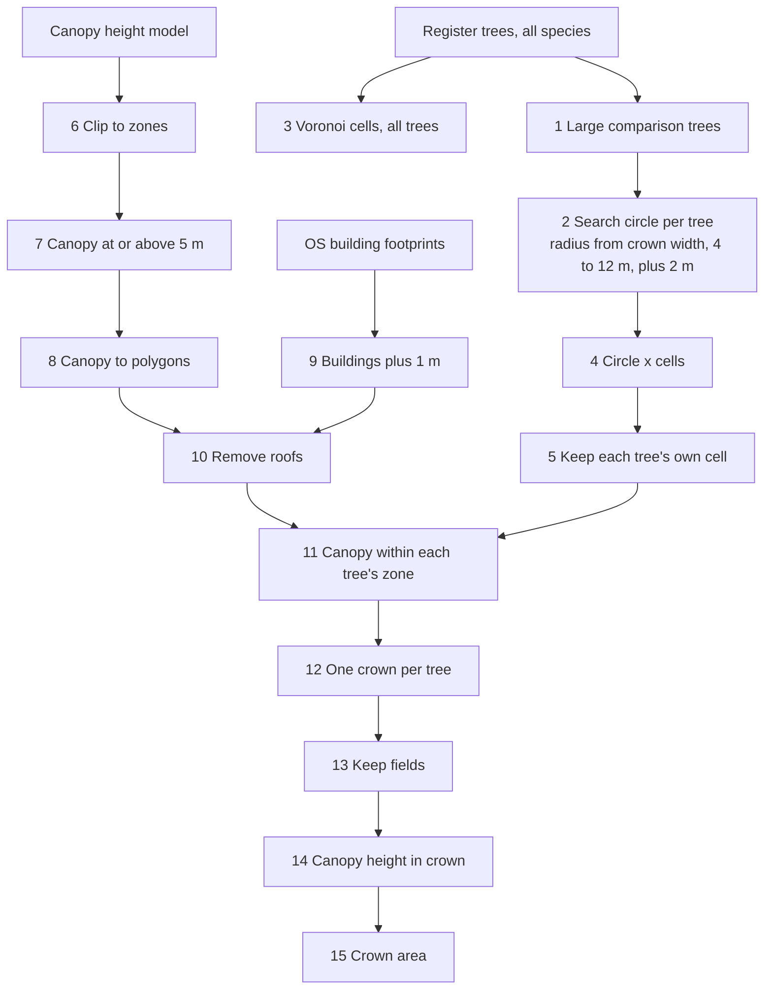

# Methods

The detail behind the README. Each section names the SQL or code that does
the work, so every number in the report can be traced back to its query.

## 1. Trees: the council register

- **Source:** Bristol City Council tree register, ArcGIS REST MapServer/32
  (Open Government Licence 3.0). Beech, oak, lime, plane and sycamore genera,
  16,451 records, paged 1,000 at a time and checked against the service's own
  count (`src/beech/ingest_register.py`).
- **Raw kept untouched:** every attribute is stored as delivered in
  `raw.register_trees`; all cleaning is SQL in `sql/02_clean.sql`, so it can
  be read and rerun.
- **Cleaning:** measurement text such as "32 Centimetres" parsed to numbers
  (tolerating the register's typos); "No Code Allocated" converted to null;
  species rolled up into comparison groups; purple-leaved trees flagged. Full
  results in `data_quality_register.md`.
- **Comparison groups:** beech, oak (*Quercus robur* and *petraea*), lime,
  plane, sycamore. Evergreen and exotic oaks are excluded.
- **Age proxy:** trunk diameter (DBH), used only in broad classes (under 20,
  20 to 49, 50 to 79, 80 cm and over), because the register's DBH values are
  partly estimated.

## 2. Study area

Bristol's local authority boundary (ONS, May 2026, clipped to the coastline)
plus 3 km. This keeps council land just over the boundary, such as Ashton
Court, and leaves out two distant council sites (a special school near
Chippenham and a field centre in the Forest of Dean: 16 comparison trees, no
beeches). Result: 16,435 comparison trees including all 985 beeches, in an
area 14 km by 14 km. From 30 September 2026 the whole register (56,581
trees) is loaded, because every tree, of any species, is needed as a
neighbour when touching crowns are split; the extra species are grouped as
"other" and are not part of any comparison.

## 3. Drought context

Met Office historic station data for Yeovilton (about 50 km south, from 1964)
and Cardiff Bute Park (about 40 km west, from 1977), because Bristol has no
long record in that series (`src/beech/ingest_weather.py`,
`sql/03_weather.sql`). Growing season rain is March to August; summer heat is
the June to August mean of monthly maximum temperatures. 2026 values are
provisional.

## 4. Satellite imagery: Sentinel-2

- **Catalogue:** Earth Search STAC on AWS, collection `sentinel-2-l2a`
  (surface reflectance, atmospherically corrected), 3,731 catalogue items
  intersecting the study area from 2017 to September 2026, reduced to one
  scene per satellite pass (`src/beech/sentinel.py`, `sql/04_sentinel.sql`).
- **Why not the reprocessed Collection 1:** it is more consistent, but it has
  no scenes over Bristol for 2022, one of the drought years the method is
  checked against, and none for 2017.
- **The processing offset, checked against the pixels:** from processing
  baseline 04.00 (January 2022, and in this archive every scene from June
  2018, which ESA reprocessed as baseline 05.00), ESA files store
  reflectance × 10,000 + 1,000, and the catalogue records an offset of −0.1
  for those scenes. The stored values show the offset has already been
  removed from these files: the 1st percentile of red over clear vegetation
  is near 0 and the median about 450 in every processing version, where a
  file carrying the offset could not store less than about 1,000. So
  reflectance is stored value × 0.0001 with no offset, for every scene
  (`src/beech/crown_indices.py`); the per-scene evidence is in
  `analysis.s2_scene_qa` and summarised in `qa.s2_offset_evidence`.
- **Years used:** 2018 to 2026. 2017 has too few scenes (13 passes from May
  to October, one under 20% cloud).
- **Normal years for the baseline:** 2019, 2020, 2021, 2023 and 2024. 2018 and
  2022 are known drought years and act as a check: if the method does not
  show them as stressed, it is not working. 2025 was also dry.
- **Clear images are scarce in normal summers.** Scenes covering the whole
  study area with under 20% cloud in July and August:

  | 2018 | 2019 | 2020 | 2021 | 2022 | 2023 | 2024 | 2025 | 2026 |
  |---|---|---|---|---|---|---|---|---|
  | 1 | 0 | 1 | 2 | 5 | 0 | 2 | 2 | 12 |

  So the method cannot rely on perfect images. It uses every scene under 60%
  tile cloud from May to October (20 to 37 a year) and masks cloud, shadow
  and snow pixel by pixel with the scene classification layer, then
  summarises each tree over a June to September window.

### Readings per crown: QGIS model 02

`qgis/models/02_crown_indices.model3` (built by
`qgis/scripts/build_model02.py`), run once per scene inside one QGIS
session by `qgis/scripts/run_model02.py`, driven by `beech-crown-indices`.

1. **Cloud mask:** scene classification classes 4 (vegetation), 5 (bare
   ground) and 7 (unclassified) are clear; everything else (cloud, cloud
   shadow, cirrus, snow, water, saturated or dark pixels) is masked.
2. to 4. **Indices** on the red band's 10 m grid, from reflectance:
   NDVI = (B08 − B04) / (B08 + B04), greenness; NDMI = (B8A − B11) /
   (B8A + B11), canopy water; NDRE = (B8A − B05) / (B8A + B05), red edge,
   an early sign of chlorophyll loss. 20 m bands are read by nearest
   neighbour. Masked pixels become no data (the formula divides by the mask).
5. to 8. **Zonal statistics** over every crown: all pixels and the clear
   share, then the number of clear pixels and the mean of each index.
9. One row per crown per scene into `analysis.crown_obs`
   (`sql/08_crown_obs.sql`).

- **Crowns in the images' own grid.** Crowns are reprojected to UTM zone
  30N (the scenes' CRS) rather than the images to British National Grid,
  so no pixel is resampled.
- **Checked against an independent calculation.** On one scene
  (26 June 2026) the model's NDVI matched NumPy to within 3 × 10⁻⁸; the
  cloud masks differed on 0.18% of pixels, all on mask edges, where the
  20 m classification grid sits 10 m off the 10 m grid and QGIS aligns it
  by position.
- **Small crowns.** Where no pixel centre falls inside a crown, QGIS weights
  the pixels it touches by their overlap, so pixel counts can be fractional.
  Which crowns hold enough pixels to analyse is decided later, in SQL.

### Removing the ground: canopy cover, model 03 and unmixing

At 10 m most crowns are a few pixels, so a crown's reading mixes canopy
with the ground around it. On the Downs, 20 open grass plots
(`src/beech/grass_reference.py`) showed grass losing 0.37 to 0.46 of summer
NDVI in dry years against under 0.1 for trees: 15% grass in a reading is
enough to fake the whole beech signal.

1. **Canopy share** (`src/beech/canopy_cover.py`): 1 m canopy (5 m or
   taller, buildings removed) averaged onto the Sentinel-2 grid, then
   averaged over each crown with model 02's pixel weighting:
   `analysis.crown_cover`. Median: beech 0.72, lime 0.35.
2. **Local ground** (`src/beech/ground_reference.py`, model 03): model 02's
   chain over a 15 m ring around each crown, keeping only pixels under 10%
   canopy: `analysis.ground_obs`. Crowns in dense groves with no ground in
   their ring take the median ground of rings within 100 m on the same
   image (`analysis.ground_nearby`).
3. **Unmixing** (`sql/11_unmixed.sql`), image by image:
   tree = (observed − (1 − f) × ground) / f, only for crowns with f of at
   least 0.5; then summer medians, normals and changes as before.

- **Validation:** after unmixing, the 2026 red edge change no longer varies
  with canopy share (−0.041 to −0.039 across four bands of f), so red edge
  is the headline index. NDVI still drifts slightly with f.
- **Approximation:** mixing is linear in reflectance, not in ratio indices;
  applying it to the indices is an approximation that removes most, not
  all, of the ground's influence.
- **Comparisons** (`src/beech/analysis.py`): medians with bootstrap 95%
  intervals (2,000 resamples, fixed seed), for all analysable crowns and
  for crowns of similar canopy share (0.70 to 0.85), so crown size cannot
  drive a species ranking.

## 5. LIDAR: tree height and crowns

- **Source:** Environment Agency LIDAR Composite, 1 m resolution (Open
  Government Licence), via its WCS service (`src/beech/lidar.py`). Two
  layers: the Digital Terrain Model (bare ground) and the first-return
  Digital Surface Model (the top of whatever the laser hit first, over a tree
  its canopy). Canopy height is surface minus terrain.
- **Only the squares that matter:** the whole 14 km study area at 1 m would
  be about 1.5 GB, mostly roofs and roads. Instead, only 1 km squares holding
  large comparison trees are fetched (trunk 40 cm or more, or crown 10 m or
  more: 9,157 trees, 366 of them beeches, in 121 squares), plus any
  neighbouring square a tree sits within 20 m of, so no crown is cut off at
  a tile edge.
- **Caveat:** the composite combines the best available survey for each
  area, so the canopy it shows is from the survey year, not 2026. Crowns are
  used only to decide which satellite pixels belong to each tree, which
  changes little over a few years; the 2017 stem loss on the case study tree
  is the kind of change that could matter and is checked by eye.

### Canopy height model (built 29 September 2026)

- Canopy height = surface model minus terrain model, negative values set to
  0, missing areas kept missing (GDAL raster calculator in QGIS). Output
  `data/lidar/chm.tif`: 14,000 by 13,000 pixels at 1 m; heights from 0 to
  53.5 m.
- **Roofs look like canopy.** A canopy height model measures everything
  standing above the ground, so houses appear as flat, square blocks of
  "canopy" 8 to 15 m high right next to street and garden trees. A crown
  drawn from height alone would swallow neighbouring roofs. The crown model
  therefore removes building footprints (Ordnance Survey Open Map Local)
  before drawing crowns, and splits touching crowns between neighbouring
  trees.
- **Sanity check:** the case study tree reads 17.8 m at its highest point,
  against about 17 m recorded by an arboriculturist in 2006 (reduced by
  about 1 m in 2017). The canopy model and an independent field measurement
  agree.

### Crowns: QGIS model 01

`qgis/models/01_tree_crowns.model3`, a QGIS Graphical Modeler model (the
open equivalent of ArcGIS ModelBuilder), run headless with `qgis_process`
by `src/beech/run_models.py`. Open it in QGIS (Processing Toolbox, Models,
Open existing model) to see the diagram.

- **Why Voronoi cells:** street and park trees stand close together and
  their canopies touch. Splitting the ground so each point belongs to its
  nearest register tree stops one tree claiming its neighbours' canopy. The
  cells are built from all 56,581 register trees, of every species, for this
  reason.
- **Why a search circle as well:** many big crowns belong to private or
  unregistered trees with no register point. The circle (radius from the
  register crown width) stops a register tree claiming a whole private
  garden's canopy.
- **Full run (30 September 2026, about one minute; rerun after heights
  switched to the clipped canopy model, identical to within one crown):** 9,157 large trees,
  **8,623 crowns (94%)**. Median crown area and height: beech 111 m², 18.4 m;
  oak 88 m², 14.6 m; plane 84 m², 16.6 m; sycamore 47 m², 13.7 m; lime
  42 m², 14.0 m. Crowns of 100 m² or more: 198 beeches, 946 planes, 448
  limes, 217 oaks, 245 sycamores. Beeches with trunks of 80 cm or more have a
  median crown of 165 m² and height of 21.0 m.
- **533 large trees had no canopy of 5 m or more at their point**, listed in
  `qa.targets_without_crown`. Most are street trees (257 limes and 61 planes
  on adopted highways). Bristol pollards many street trees hard, so they are
  likely to have been below 5 m when the LIDAR was flown; others may be
  felled or misplaced.
- **Prototype check (Durdham Down, 1.5 km square, 30 September 2026):** 437
  large trees, 424 crowns; crowns follow the canopy, stay off roofs, and
  touching avenue trees are split. Median crown area: beech 138 m², oak
  76 m², lime 53 m², plane 38 m², sycamore 36 m².

## 6. Field check sample

`sql/05_field_sample.sql`. Clifton and Durdham Downs was chosen because it
holds the city's largest group of big council beeches (39 with a trunk of
80 cm or more) alongside large oak, lime and sycamore, all in one walkable
area. Trees are drawn at random within each stratum (random order is a hash
of the OBJECTID with a fixed salt, so the draw is reproducible):

| Stratum | Trees | Priority |
|---|---|---|
| Beech, 80 cm and over | 15 | 1 |
| Beech, 50 to 79 cm | 12 | 1 |
| Beech, 20 to 49 cm | 10 | 1 |
| Oak, 50 cm and over | 8 | 1 |
| Lime, 50 cm and over | 8 | 1 |
| Sycamore, 50 cm and over | 5 | 2 |
| Beech, nearby parks (St Andrews Park, Redland Playing Fields) | 3 | 2 |

53 core trees, 61 in all. **The sample is frozen as issued** in
`raw.field_sample_frozen`, keyed by the council's ASSET_ID, because the
council's OBJECTIDs were regenerated the day after the draw (see
`data_quality_register.md`). Genus-only records are allowed, because many of
the Downs limes are recorded only as *Tilia*. Crown condition is scored with
the ICP Forests classes for defoliation and discolouration, before leaf fall
in October 2026.

**Walk and loading (30 September 2026).** 41 trees visited, 40 found.
Returns are copied as delivered into `raw.field_returns` by
`beech-load-field-returns` and joined to the sample in
`sql/07_field_check.sql`. A tree is **compared** if it was found, its
species confirmed, and it is not set aside in `analysis.field_exclusions`
(one tree: a dead monolith the register lists as live). A tree is
**stressed** if thinning or browning is class 2 or more, or it has dead
branches or limbs. Coverage and results by stratum and species are in
`analysis.field_check_summary`; checks in `qa.field_returns_*`.

## 7. Still to come

Satellite indices per crown (QGIS model 02), anomalies and comparisons,
the field check against the satellite, and the inspection list.
